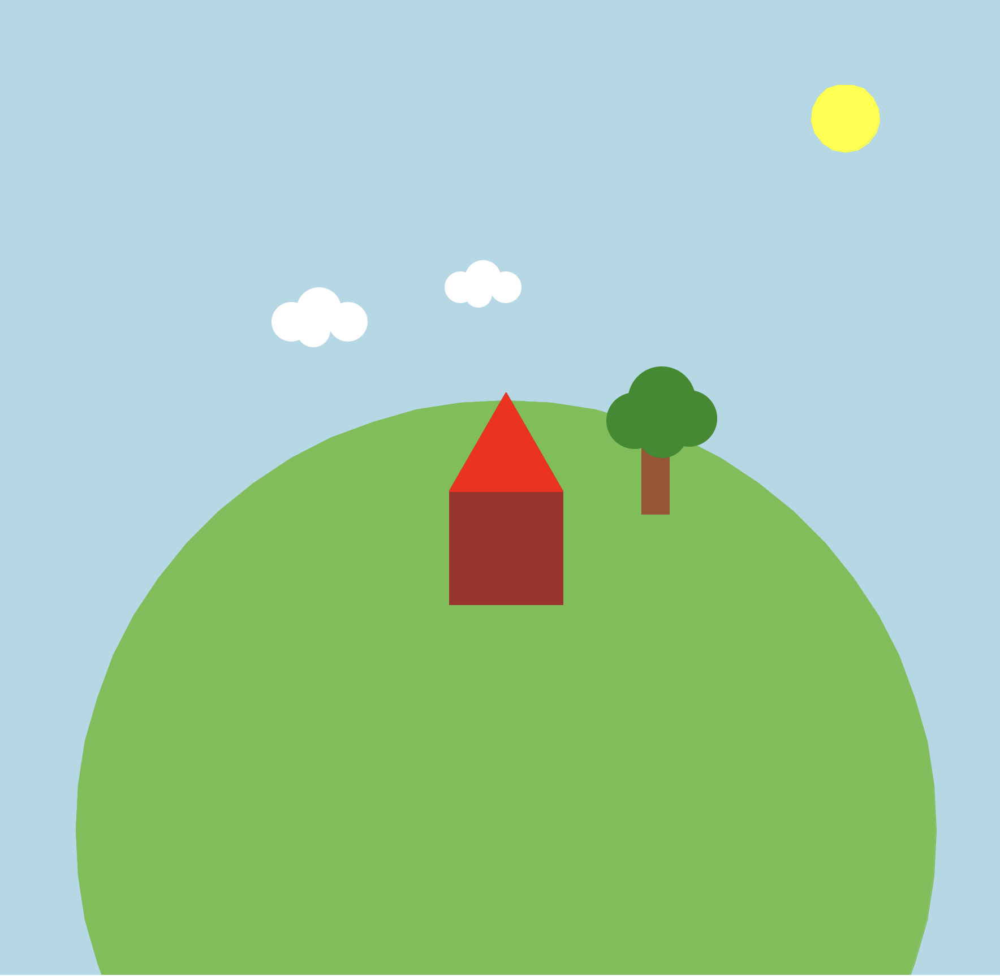

# Python Turtle Design Challenge

Create a picture using Python turtle graphics.

## Example

## Your Program Must Include

- 2 functions
- 1 loop
- 3 different shapes
- 3 colors
- 1 original detail (something creative you add)

## Design Ideas

- a house
- a snowman
- a robot
- a flower
- a park
- a face

## Grading Example (100 points total)

- 20 pts: program runs correctly
- 20 pts: uses at least 2 functions
- 20 pts: uses a loop correctly
- 20 pts: includes required shapes and colors
- 20 pts: creativity and effort

## Tips

- Plan your picture first on paper.
- Build one part at a time and test often.
- Use functions to avoid repeating code.
- Try changing colors, sizes, and positions to make it your own.
